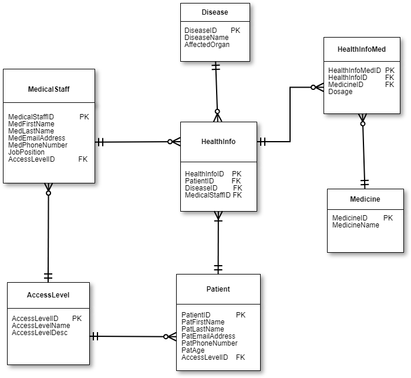

                                         **Healthcare Support Database**
                                                  Aman Panwar

**Introduction and Mission Statement:**

A hospital(client) wants to build a database system to manage the healthcare records of its patients and improve access to the health care records for all its users and improve its day to day management processes. The main goal of building this database is to improve the short-term and long-term health and comfort level of patients. 

After analyzing client's needs, the database designer summarized the following points:

•	The healthcare database should have patients’ health records like the disease/s they have, the medicine/s for the corresponding disease, the medical staff who treated them and their corresponding contact information.

•	The hospital has currently 100 patients and 100 medical staff members and doctors and nurses come under medical staff. The database should have only medical staff’s personal information and job position.

•	Medical staff and patients have different access levels. Doctors can access patient and nurse records and prescribe medicines to patients. Nurses can access patient and doctor records. Patients can access only his or her health information and medical staff information.

•	The database should have list of names of diseases and the major organ affected. For example, a person suffering from asthma would have lung as its major organ affected.

•	The database should have list of names of medicines.

Based on client's requirements, an ER diagram was created which is as follows:

More details on client's requirements:

•	Patient can have only one access level and one access level can be assigned to multiple patients.

•	Medical staff can have only one access level and one access level can be assigned to multiple medical staff.

•	A patient can be treated by multiple medical staff and a medical staff can treat multiple patients.

•	A patient can have multiple diseases and a disease can affect more than one patient.

•	A medicine can be prescribed for multiple diseases and a disease can be treated by multiple medicines.

•	Doctor can access patient and nurse records and prescribe medicines to patients.

•	Nurse can access patient and doctor records.

•	Patient can access only his or her health information and medical staff information.

**Mission objectives:**

To achieve the goals stated in mission statement, the client wants some specific objectives to be fulfilled. One or two queries are written to achieve each objective.

**Objective: Health records can be accessed easily by all its users.**

Sub-objective: Search PatientID using first and last name

Query 1: 

select PatientID from Patient where PatFirstName="Macey" and PatLastName="Olson";

Output:

*#PatientID

45*

**Objective: Health records can be accessed easily by all its users. **

Sub-objective: Search the disease and corresponding Medical StaffID and their contact information using PatientID

Query 2: 

select MedFirstName as FirstName , MedLastName as LastName, MedEmailAddress as EmailAddress, MedPhoneNumber as 

PhoneNumber,JobPosition, DiseaseName as DiseaseTreated

from (( HealthInfo

inner join MedicalStaff on HealthInfo.MedicalStaffID= MedicalStaff.MedicalStaffID)

inner join Disease on HealthInfo.DiseaseID= Disease.DiseaseID)

where PatientID =70 ;

Output:

*# FirstName , LastName , EmailAddress,                            PhoneNumber,    JobPosition, DiseaseTreated

   Mannix	   Miles	  accumsan.convallis@Maurisblanditenim.ca  1-237-475-0544     Doctor    Lower respiratory infections
*

**Objective: Hospital management system can be improved by leveraging the information from existing health care records.**

Sub-objective: Average appointments attended by doctors and nurses

Query 3: 

select Appt_Doctors/TotalDoctor as Avg_Appt_Doctor, Appt_Nurse/TotalNurse as Avg_Appt_Nurse

 from (select count(HealthInfoID) as Appt_Doctors  from HealthInfo, MedicalStaff 
 
where HealthInfo.MedicalStaffID=MedicalStaff.MedicalStaffID and JobPosition="Doctor") as a,

(select count(MedicalStaffID) as TotalDoctor from MedicalStaff where  JobPosition="Doctor") as c,

(select count(HealthInfoID) as Appt_Nurse  from HealthInfo, MedicalStaff 

where HealthInfo.MedicalStaffID=MedicalStaff.MedicalStaffID and JobPosition="Nurse")as b ,

(select count(MedicalStaffID) as TotalNurse from MedicalStaff where  JobPosition="Nurse") as d;

Output:

*#Avg_Appt_Doctor    Avg_Appt_Nurse

  3.3061             2.7059*

**Objective: Hospital management system can be improved by leveraging the information from existing health care records.**

Sub-objective: Percentage of patients who are younger than a certain age

Query 4: 

select (people/count(HealthInfoID)*100) as PercentOfPeopLessThan from HealthInfo,(

select count(HealthInfoID) as people from Patient,HealthInfo where HealthInfo.PatientID =Patient.PatientID

and PatAge <=13)a ;

Output:

#PercentOfPeopLessThan

12

**Objective: Pharmacy stores linked to hospital can keep their inventories up to date using the current database records.**

Sub-ojective: Generate list of highly prescribed medicines

Query 5: 
select MedicineName, count(HealthInfoMed.MedicineID) as PrescriptionFrequency from 
Medicine,HealthInfoMed where HealthInfoMed.MedicineID=Medicine.MedicineID
group by MedicineName order by (count(HealthInfoMed.MedicineID) ) desc
LIMIT 5;

Output:

**Objective: Healthcare records can be used to contribute to national research database to improve the long-term health of patients**

Sub-objective: Major diseases reported in hospital

Query 6:

select DiseaseName, count(HealthInfo.HealthInfoID) as Frequency from 

Disease, HealthInfo where HealthInfo.DiseaseID=Disease.DiseaseID

group by DiseaseName order by(count(HealthInfo.HealthInfoID) )desc;

Output:

*#DiseaseName, Frequency

'diarrheal diseases', '37'

'Cirrhosis', '35'

'Diabetes mellitus', '33'

'coronary artery disease', '31'

'lung cancers', '30'*

**Objective: Healthcare records can be used to contribute to national research database to improve the long-term health of patients**

Sub-objective: Number of cases reported for patients above certain age

Query 7:

select AffectedOrgan, count(HealthInfoID) as Frequency from 

HealthInfo,Disease,Patient where HealthInfo.DiseaseID=Disease.DiseaseID and 

HealthInfo.PatientID=Patient.PatientID and PatAge >=55 

group by AffectedOrgan order by(count(HealthInfoID) )desc;

LIMIT 3

Output:
*#AffectedOrgan Frequency

   Heart          18
   
   Lung           11
   
   GI             8
*
  
